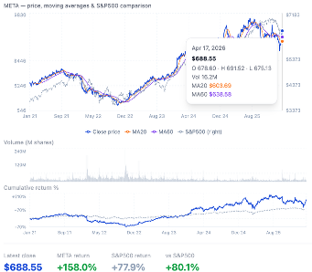
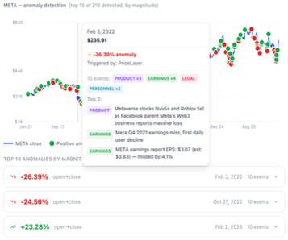
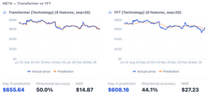
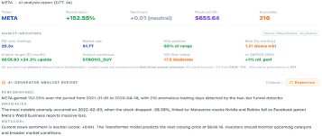
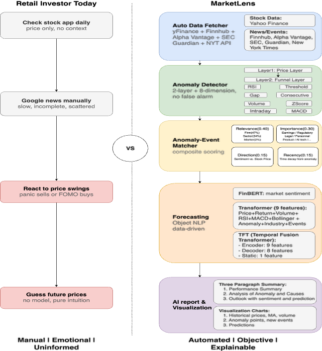

# MarketLens

> An end-to-end equity analysis pipeline that fuses anomaly detection, FinBERT news sentiment, Transformer + TFT price forecasting, and GPT-4o analyst reports — served as an interactive web app.

---

<!-- TODO: Add 15-30s demo gif here showing Stage 1 → Stage 2 → Stage 3 loading -->

When something unusual happens to a stock — a 7% gap, a volume spike, a sudden trend break — analysts spend hours stitching the story together: pull the chart, scroll the news feed, eyeball the technicals, write the memo. MarketLens runs that loop end-to-end in one click. Pick a ticker and date range, and the dashboard surfaces the anomalous trading days, links each one to the news that probably caused it, scores market sentiment with a finance-tuned language model, forecasts the next five days with two competing deep-learning architectures, and writes a structured analyst report on top of the result.

## Live demo

**[Try it → MarketLens]([https://[DEPLOYED_URL_PLACEHOmarket-lens-showcase.vercel.appLDER])**

<!-- TODO: Replace with real deployed URL once Vercel (frontend) + Railway (backend) are live -->

| Stage 1 — auto-loaded | Stage 2 — auto-loaded | Stage 3 — on demand | Stage 4 — on demand |
| --- | --- | --- | --- |
|  |  |  |  |

## What it does

- **Data fetcher** — incremental yFinance + Finnhub fetch with CSV cache; appends only new trading days per refresh.
- **Anomaly detector** — 8-detector funnel with two-tier voting (any ≥5% move flagged immediately; otherwise needs ≥2 detectors agreeing).
- **Sentiment + forecasting** — FinBERT for finance-tuned sentiment, then Transformer and Temporal Fusion Transformer trained side-by-side on 9 features (8 technical + sentiment).
- **GPT-4o report generator** — structured 3-section / 3-bullet output with a local fallback if the API call fails.
- **FastAPI backend + React frontend** — three progressive load stages (auto-loaded Stage 1, on-demand Stage 2 forecast, on-demand Stage 3 report) so first paint stays fast.

## Results

Walk-forward, out-of-sample on **META** (5y train / 6w validation).

| Model | MAE ($) | Directional accuracy | MAPE |
| --- | --- | --- | --- |
| Naive (last close) | TODO | TODO | TODO |
| SMA-5 | TODO | TODO | TODO |
| SMA-20 | TODO | TODO | TODO |
| **Transformer (9 feat, seq=20)** | TODO | TODO | TODO |
| **TFT (9 feat, seq=20, dec=5)** | TODO | TODO | TODO |

> <!-- TODO: Run `python scripts/walk_forward_validation.py` and paste the printed MAE / Dir Acc / MAPE for each row. The improvement-vs-best-baseline % is also printed at the bottom of the run. -->

## Team

| Contributor | Role / Modules owned | LinkedIn |
| --- | --- | --- |
| Wanjing Yang | [TODO: e.g., "Anomaly detection + GPT-4o reports"] | [TODO: linkedin url] |
| [Teammate 2] | [TODO] | [TODO] |
| [Teammate 3] | [TODO] | [TODO] |
| [Teammate 4] | [TODO] | [TODO] |

## Awards

**Northeastern University Spring 2026 Showcase** — [TODO: AWARD_NAME_1] · [TODO: AWARD_NAME_2]

---

<b>Technical deep dive</b> (click to expand)

### 1. Data fetcher

Pulls historical OHLCV from Yahoo Finance and news / corporate events from Finnhub, with optional fallbacks to Alpha Vantage, yfinance events, and a curated event list. Fetches are **incremental** — `warm_up.py` checks the existing CSV cache and only appends new trading days, so the daily refresh costs seconds instead of a full re-download. The composite news fetcher degrades gracefully: if Finnhub is missing or rate-limited, the pipeline still runs on the remaining sources rather than failing.

### 2. Anomaly detector — 8-detector funnel with two-tier strategy

Eight independent detectors (z-score on returns, Bollinger band breaks, RSI, MACD crossover, volume spike, opening gap, intraday range, consecutive same-direction moves) each implement a single `AnomalyDetector` interface. The `FunnelDetector` composes them with a deliberate two-tier rule: **Tier 1** flags any day with |close-to-close %| ≥ 5% immediately (fast path for the obvious moves); **Tier 2** runs the full ensemble and only flags a day if **≥ 2 detectors agree**. The two-tier design is the interesting part — a single detector is too noisy in isolation, but a hard agreement threshold misses the screamingly large moves no one would dispute. Adding a new detector means adding one subclass; the funnel composition stays untouched.

### 3. Sentiment + forecasting — FinBERT × Transformer × TFT

News sentiment is scored with **ProsusAI/finbert** (BERT pretrained on financial text), not a generic LLM — domain-tuned, runs locally on CPU, and costs nothing per call. Daily sentiment is then folded into a 9-feature input vector (8 technical features + 1 sentiment) for two competing forecasters trained side-by-side: a plain **Transformer encoder** (300 epochs, d_model=64, 4 heads, 2 layers, seq_len=20) and a **Temporal Fusion Transformer** (encoder–decoder with Gated Residual Networks, a Variable Selection Network, and multi-head attention; 50 epochs, hidden=64, 5-day decoder). Running both means we can show recruiters the *comparison* and not just the result — and the TFT's Variable Selection Network learns which of the 9 features actually drives the prediction, giving us interpretability the Transformer doesn't.

Validation is **walk-forward, out-of-sample, with no peeking**: the `MinMaxScaler` is fit on the training window only, and the model rolls one trading day at a time across an unseen 6-week window. We benchmark against three sane baselines (naive last-close, SMA-5, SMA-20) so the reported MAE means something.

Validation setup:
- Training window: **2021-01-01 → 2026-02-28** (~5 years, ~1,300 trading days)
- Validation window: **2026-03-01 → 2026-04-15** (6 weeks, never seen during training or scaler fit)
- Features: 8 technical (close, return, volume, RSI, MACD, Bollinger, anomaly flag, sector) + 1 daily FinBERT sentiment
- Baselines compared: Naive (yesterday's close), SMA-5, SMA-20

### 4. GPT-4o report generator

A `PromptBuilder` abstraction (Standard / Risk variants) packages the `AnalysisResult` into a tightly constrained prompt: exactly three sections (`PERFORMANCE`, `ANOMALIES`, `OUTLOOK`), exactly three bullets each, each bullet under 100 characters, plain text only — no markdown, no hedge words. The structured constraint is what makes the output dashboard-renderable instead of a freeform paragraph. A local fallback report is generated automatically if the OpenAI call fails, so a missing API key downgrades the feature instead of breaking the page.

### 5. FastAPI backend + React frontend

Four-endpoint FastAPI service (`/api/analyze`, `/api/forecast`, `/api/report`, `/api/market-info`) with disk-cached forecasts in `data_cache/`. The React 19 + Recharts frontend loads in **three progressive stages** — Stage 1 (price + anomalies + sentiment) auto-loads in 1–2 seconds from cache; Stage 2 (forecast charts) and Stage 3 (live market metrics + GPT-4o report) are on-demand button clicks. The split exists because Stage 2 costs ~3 minutes the first time and Stage 3 costs an OpenAI call — neither belongs on first paint.

### Architecture

The pipeline at full resolution, including the 8-detector funnel (Layer 1 price gate + Layer 2 agreement vote), the anomaly-event matcher's composite scoring (Relevance / Importance / Direction / Recency), and the Transformer + TFT comparison — alongside the "Retail Investor Today" vs MarketLens framing.

<!-- > Editable source: [`docs/Architecture.drawio`](docs/Architecture.drawio) (open with [draw.io](https://app.diagrams.net/)).

<b>Tech stack</b> (click to expand)
 -->

**ML / AI**
- PyTorch 2.6 (CPU build) — Transformer encoder, Temporal Fusion Transformer
- HuggingFace `transformers` + ProsusAI/finbert — domain-tuned sentiment
- scikit-learn — MinMax scaling, walk-forward splits
- OpenAI GPT-4o — structured analyst report generation

**Backend**
- FastAPI + Uvicorn — 4-endpoint async API with CORS
- pandas / numpy — feature engineering and time series handling
- python-dotenv — env-based secrets

**Frontend**
- React 19 + Vite — progressive 3-stage dashboard
- Recharts — anomaly scatter, forecast comparison, sentiment gauge
- Tailwind CSS — utility styling
- lucide-react — iconography

**Data**
- yfinance — OHLCV + live market metrics (P/E, beta, VIX, analyst rating)
- Finnhub API — historical news / corporate events (free tier)
- Alpha Vantage (optional fallback) and a curated `KnownEventsFetcher`

**Infrastructure**
- Vercel — frontend (`vercel.json`)
- Railway — backend (FastAPI service running `uvicorn app.backend.api:app`)
- CSV / JSON disk cache in `data_cache/` for warm starts

<b>API endpoints</b> (click to expand)

| Endpoint | Description |
| --- | --- |
| `GET /api/analyze/{ticker}?start=&end=` | Stage 1: prices, anomalies, FinBERT sentiment |
| `GET /api/forecast/{ticker}?start=&end=` | Stage 2: Transformer + TFT forecast (disk-cached) |
| `GET /api/report/{ticker}?start=&end=` | Stage 3: GPT-4o analyst report |
| `GET /api/market-info/{ticker}` | Live market metrics (P/E, beta, VIX, analyst rating) |
| `GET /health` | Health check |

`end` defaults to today if omitted.

## Setup & local development

See [docs/SETUP.md](docs/SETUP.md).

## License

MIT
